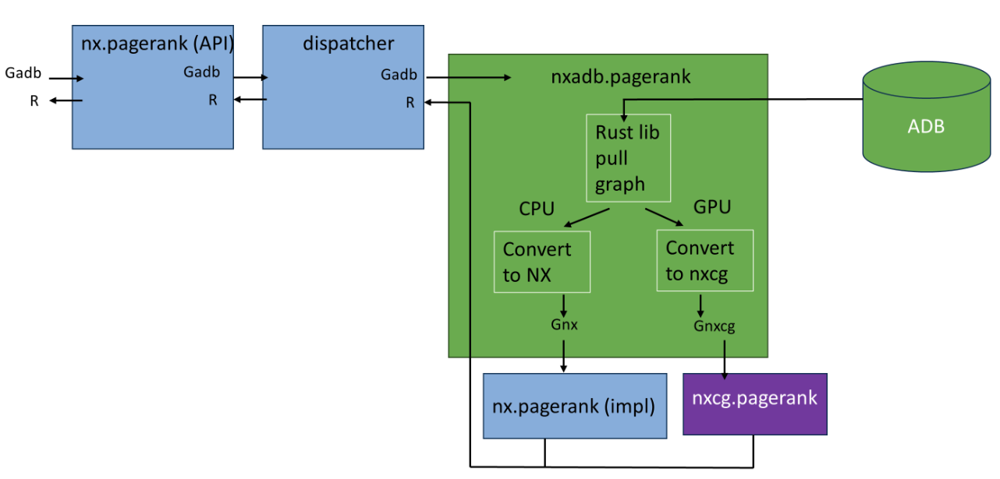

# nx-arangodb


<div style="display: flex; align-items: center; gap: 10px;">
    <a href="https://networkx.github.io/">
        
    </a>
    <a href="https://www.arangodb.com/">
        
    </a>
    <a href="https://rapids.ai/">
        
    </a>
    <a href="https://www.nvidia.com/en-us/startups/">
        
    </a>
</div>

<br>

<a href="https://colab.research.google.com/github/arangodb/nx-arangodb/blob/main/doc/nx_arangodb.ipynb" target="_parent"></a>
[](https://dl.circleci.com/status-badge/redirect/gh/arangodb/nx-arangodb/tree/main)
[](https://github.com/arangodb/nx-arangodb/actions/workflows/analyzee.yaml)
[](https://github.com/arangodb/nx-arangodb/actions/workflows/docs.yaml)

[](https://pypi.org/project/nx-arangodb/)
[](https://pypi.org/project/nx-arangodb/)

[](https://github.com/psf/black)
[](https://pepy.tech/project/nx-arangodb)


https://github.com/user-attachments/assets/e5f56574-d3ef-452c-ab21-b47b3d5d5900


## What is this?

This is a [backend to NetworkX](https://networkx.org/documentation/stable/reference/backends.html) that offers [ArangoDB](https://github.com/arangodb/arangodb) as a [Persistence Layer to NetworkX Graphs](https://arangodb.com/introducing-the-arangodb-networkx-persistence-layer/):
1. Persist NetworkX Graphs to ArangoDB.
2. Reload NetworkX Graphs from ArangoDB.
2. Perform CRUD on ArangoDB Graphs via NetworkX.
3. Run algorithms (CPU & GPU) on ArangoDB Graphs via NetworkX.

Benefits of having ArangoDB as a backend to NetworkX include:
1. No need to re-create the graph every time you start a new session.
2. Access to GPU-accelerated graph analytics ([nx-cugraph](https://docs.rapids.ai/api/cugraph/nightly/nx_cugraph/nx_cugraph/)).
3. Access to a database query language ([Arango Query Language](https://arangodb.com/sql-aql-comparison/)).
4. Access to a visual interface for graph exploration ([ArangoDB Web UI](https://docs.arangodb.com/stable/components/web-interface/graphs/)).
5. Access to cross-collaboration on the same graph ([ArangoDB Cloud](https://docs.arangodb.com/stable/get-started/set-up-a-cloud-instance/)).
6. Access to efficient distribution of graph data ([ArangoDB SmartGraphs](https://docs.arangodb.com/stable/graphs/smartgraphs/)).

<p align="center">
    
</p>


## Does this replace NetworkX?

Not really. This is a plugin to NetworkX, which means that you can use NetworkX as you normally would, but with the added benefit of persisting your graphs to a database.

```python
import os
import networkx as nx
import nx_arangodb as nxadb

os.environ["DATABASE_HOST"] = "http://localhost:8529"
os.environ["DATABASE_USERNAME"] = "root"
os.environ["DATABASE_PASSWORD"] = "openSesame"
os.environ["DATABASE_NAME"] = "_system"

G = nxadb.Graph(name="MyGraph")

G.add_node(1, foo='bar')
G.add_node(2, bar='foo')
G.add_edge(1, 2, weight=2)

res = nx.pagerank(G)

for k, v in res.items():
    G.nodes[k]['pagerank'] = v
```

## Does this mean I need to learn ArangoDB?

No. You can use `nx-arangodb` without knowing anything about ArangoDB. The UX of `nx-arangodb` is designed to be as close as possible to the UX of NetworkX. See the ReadTheDocs for a list of features that are currently unsupported/in-development.

```python
import os
import networkx as nx
import nx_arangodb as nxadb

# os.environ ...

# Re-connect to the graph
G = nxadb.Graph(name="MyGraph")

assert G.number_of_nodes() == 2
assert G.number_of_edges() == 1
```


## How do I install it?

```bash
pip install nx-arangodb
```

### What if I want to use nx-cuGraph with it?

```bash
pip install nx-cugraph-cu12 --extra-index-url https://pypi.nvidia.com
pip install nx-arangodb
```

## How can I set up ArangoDB?

**1) Local Instance via Docker**

Appears on `localhost:8529` with the user `root` & password `openSesame`.

More info: [arangodb.com/download-major](https://arangodb.com/download-major/).

```bash
docker run -e ARANGO_ROOT_PASSWORD=openSesame -p 8529:8529 arangodb/arangodb
```

**2) ArangoDB Cloud Trial**

[ArangoGraph](https://dashboard.arangodb.cloud/home) is ArangoDB’s Cloud offering to use ArangoDB as a managed service.

A 14-day trial is available upon sign up.

**3) Temporary Cloud Instance via Python**

A temporary cloud database can be provisioned using the [adb-cloud-connector](https://github.com/arangodb/adb-cloud-connector?tab=readme-ov-file#arangodb-cloud-connector) python package.

```python
# !pip install adb-cloud-connector

import os
from adb_cloud_connector import get_temp_credentials

credentials = get_temp_credentials()

os.environ["DATABASE_HOST"] = credentials["url"]
os.environ["DATABASE_USERNAME"] = credentials["username"]
os.environ["DATABASE_PASSWORD"] = credentials["password"]
os.environ["DATABASE_NAME"] = credentials["dbName"]

# ...
```

## How does algorithm dispatching work?

`nx-arangodb` will automatically dispatch algorithm calls to either CPU or GPU based on if `nx-cugraph` is installed. We rely on a rust-based library called [phenolrs](https://github.com/arangoml/phenolrs) to retrieve ArangoDB Graphs as fast as possible.

You can also force-run algorithms on CPU even if `nx-cugraph` is installed:

```python
import os
import networkx as nx
import nx_arangodb as nxadb

# os.environ ...

G = nxadb.Graph(name="MyGraph")

nx.config.backends.arangodb.use_gpu = False

nx.pagerank(G)
nx.betweenness_centrality(G)
# ...

nx.config.backends.arangodb.use_gpu = True
```

<p align="center">
    
</p>


## Can I create an ArangoDB Graph from an existing NetworkX Graph?

Yes, this is actually the recommended way to start using `nx-arangodb`:

```python
import os
import networkx as nx
import nx_arangodb as nxadb

# os.environ ...

G_nx = nx.karate_club_graph()

G_nxadb = nxadb.Graph(
    incoming_graph_data=G_nx,
    name="MyKarateGraph"
)

assert G_nxadb.number_of_nodes() == G_nx.number_of_nodes()
assert G_nxadb.number_of_edges() == G_nx.number_of_edges()
```
