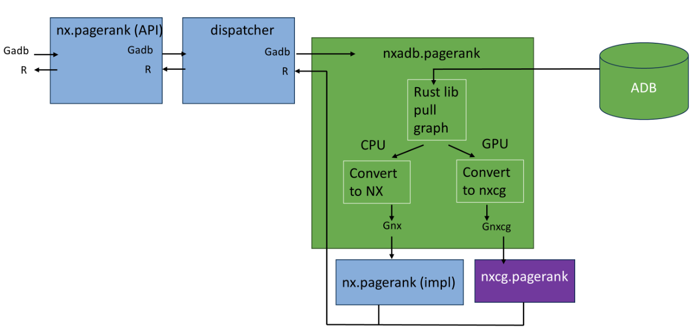

.. _algorithms:

**********
Algorithms
**********

As NetworkX-ArangoDB is primarily a **Storage Backend** to NetworkX, its primary focus is on persisting and reloading graphs from ArangoDB.

However, running algorithms on the graph is also still possible.

There are 3 ways to run algorithms on the graph:

1. **NetworkX**: The traditional way of running algorithms on Graphs.
2. **NetworkX-cuGraph**: The GPU-accelerated way of running algorithms on Graphs.
3. **ArangoDB**: The database way of running algorithms on Graphs.

Currently, Options 1 & 2 are supported, whereas Option 3 is a work-in-progress.

Running algorithms with Option 2 requires ``nx-cugraph`` to be installed on a system with a compatible GPU:

.. code-block::

   pip install nx-cugraph-cu12 --extra-index-url https://pypi.nvidia.com

When running algorithms with Option 2, the graph is converted to a ``nx-cugraph`` graph, and the algorithm is run on the GPU.

This is only possible if ``nx-cugraph`` has implemented the algorithm you want to run.

- For a list of algorithms that are supported by ``nx-cugraph``, refer to the `nx-cugraph README <https://github.com/rapidsai/cugraph/tree/branch-24.10/python/nx-cugraph#algorithms>`_.
- For a list of algorithms that are supported by ``networkx``, refer to the `NetworkX Documentation <https://networkx.org/documentation/stable/reference/algorithms/index.html>`_.

``nx-arangodb`` will automatically dispatch algorithm calls to either CPU or GPU based on if ``nx-cugraph`` is installed. We rely on a rust-based library called `phenolrs <https://github.com/arangoml/phenolrs>`_ to retrieve ArangoDB Graphs as fast as possible.

You can also force-run algorithms on CPU even if ``nx-cugraph`` is installed:

.. code-block:: python

   import os
   import networkx as nx
   import nx_arangodb as nxadb

   # os.environ ...

   G = nxadb.Graph(name="MyGraph")

   nx.config.backends.arangodb.use_gpu = False

   nx.pagerank(G)
   nx.betweenness_centrality(G)
   # ...

   nx.config.backends.arangodb.use_gpu = True

**Tip**: If you're running multiple CPU algorithms, it's recommended to rely on invoking ``nxadb.convert.nxadb_to_nx`` to convert the graph to a NetworkX Graph before running the algorithms.
This is because we currently load the entire graph into memory before running *each* algorithm, which can be slow for large graphs.

.. code-block:: python

   import networkx as nx
   import nx_arangodb as nxadb

   G_adb = nxadb.Graph(name="MyGraph")

   G_nx = nxadb.convert.nxadb_to_nx(G)

   nx.pagerank(G_nx)
   nx.betweenness_centrality(G_nx)
   # ...

**Option 3**

This is an experimental module seeking to provide server-side algorithms for `nx-arangodb` Graphs.
The goal is to provide a set of algorithms that can be delegated to the server for processing,
rather than having to pull all the data to the client and process it there.

Currently, the module is in a very early stage and only provides a single algorithm: `shortest_path`.
This is simply to demonstrate the potential of the module and to provide a starting point for further development.

.. code-block:: python

    import os
    import networkx as nx
    from nx_arangodb as nxadb

    # os.environ ...

    G = nxadb.Graph(name="MyGraph")

    nx.pagerank(G) # Runs on the client
    nx.shortest_path(G, source="A", target="B") # Runs on the DB server
    nx.shortest_path.orig_func(G, source="A", target="B") # Runs on the client
