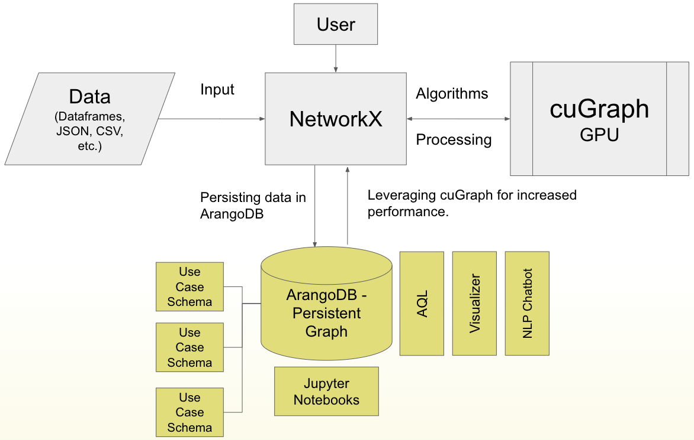

nx-arangodb
============

.. raw:: html

    

        
        
        
        
    

.. raw:: html

     

.. image:: https://colab.research.google.com/assets/colab-badge.svg
   :target: https://colab.research.google.com/github/arangodb/nx-arangodb/blob/main/doc/nx_arangodb.ipynb
   :alt: Open In Colab

.. image:: https://dl.circleci.com/status-badge/img/gh/arangodb/nx-arangodb/tree/main.svg?style=svg
   :target: https://dl.circleci.com/status-badge/redirect/gh/arangodb/nx-arangodb/tree/main
   :alt: CircleCI

.. image:: https://github.com/arangodb/nx-arangodb/actions/workflows/analyzee.yaml/badge.svg
   :target: https://github.com/arangodb/nx-arangodb/actions/workflows/analyzee.yaml
   :alt: CodeQL

.. image:: https://github.com/arangodb/nx-arangodb/actions/workflows/docs.yaml/badge.svg
   :target: https://github.com/arangodb/nx-arangodb/actions/workflows/docs.yaml
   :alt: Docs

.. image:: https://img.shields.io/pypi/v/nx-arangodb?color=3775A9&style=for-the-badge&logo=pypi&logoColor=FFD43B
   :target: https://pypi.org/project/nx-arangodb/
   :alt: PyPI version badge

.. image:: https://img.shields.io/badge/3.10%2B-3776AB?style=for-the-badge&logo=python&logoColor=FFD43B&label=Python
   :target: https://pypi.org/project/nx-arangodb/
   :alt: Python versions badge

.. image:: https://img.shields.io/static/v1?style=for-the-badge&label=code%20style&message=black&color=black
   :target: https://github.com/psf/black
   :alt: Code style: black

.. image:: https://img.shields.io/pepy/dt/nx-arangodb?style=for-the-badge&color=282661
   :target: https://pepy.tech/project/nx-arangodb
   :alt: Downloads

This is a `backend to NetworkX <https://networkx.org/documentation/stable/reference/backends.html>`_ that offers `ArangoDB <https://github.com/arangodb/arangodb>`_ as a `Persistence Layer to NetworkX Graphs <https://arangodb.com/introducing-the-arangodb-networkx-persistence-layer/>`_:

1. Persist NetworkX Graphs to ArangoDB.
2. Reload NetworkX Graphs from ArangoDB.
3. Perform CRUD on ArangoDB Graphs via NetworkX.
4. Run algorithms (CPU & GPU) on ArangoDB Graphs via NetworkX.

Benefits of having ArangoDB as a backend to NetworkX include:

1. No need to re-create the graph every time you start a new session.
2. Access to GPU-accelerated graph analytics (`nx-cugraph <https://docs.rapids.ai/api/cugraph/nightly/nx_cugraph/nx_cugraph/>`_).
3. Access to a database query language (`Arango Query Language <https://arangodb.com/sql-aql-comparison/>`_).
4. Access to a visual interface for graph exploration (`ArangoDB Web UI <https://docs.arangodb.com/stable/components/web-interface/graphs/>`_).
5. Access to cross-collaboration on the same graph (`ArangoDB Cloud <https://docs.arangodb.com/stable/get-started/set-up-a-cloud-instance/>`_).
6. Access to efficient distribution of graph data (`ArangoDB SmartGraphs <https://docs.arangodb.com/stable/graphs/smartgraphs/>`_).

Requirements
------------
- Python 3.10+
- NetworkX 3.0+
- ArangoDB 3.10+

Installation
------------

Latest Release

.. code-block::

   pip install nx-arangodb

Current State

.. code-block::

   pip install git+https://github.com/arangodb/nx-arangodb

Contents
--------

The UX of NetworkX-ArangoDB is similar to that of NetworkX, but with the
added functionality of persisting graphs to ArangoDB. For an understanding
of how to use NetworkX, refer to the `NetworkX Documentation <https://networkx.org/documentation/stable/reference/index.html>`_.

Expect documentation to grow over time:

.. toctree::
   :maxdepth: 2

   quickstart
   classes/index
   dict/index
   algorithms/index
   views/index